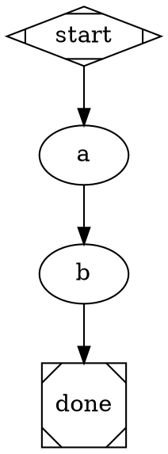
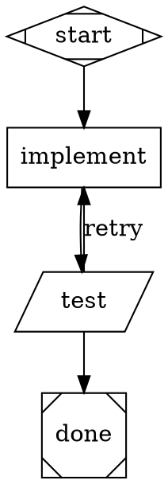
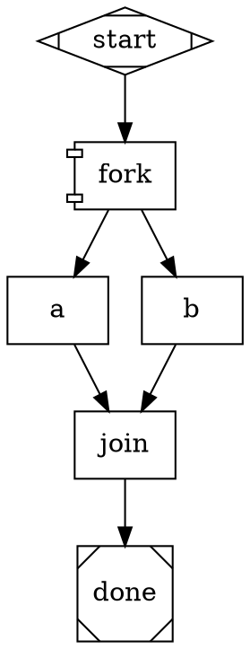

# DOT Pipeline Reference Card

> Ported from `microsoft/amplifier-bundle-attractor@main`'s `context/dot-reference.md`
> (2026-08-10), corrected against this engine's actual shape/attribute set — see
> [ADR-018](../../../.delivery/decisions/ADR-018-reference-material-porting-split.md).
> Lint code meanings are never restated here — see `README.md`'s own
> [`## Lint rules`](../../../README.md#lint-rules) section, the single source of truth.

Quick reference for authoring `attractor` DOT pipelines on **this engine** — not amplifier's.

## Node shapes → handlers

Seven handlers this build registers (`core/engine.ts`'s `defaultHandlers()`) — these are
the only shapes an authored graph may use. `hexagon`/`human` was unregistered when this
file was first ported (S7); it registered in Phase 2 (FR-5-8, 2026-08-11) and is now a
real, usable node kind — see `08-human-gate.dot` for a worked example and
`.superpowers/specs/2026-08-05-human-gate-channels-design.md` for the full channel design.

| Shape | Handler | Purpose |
| :-- | :-- | :-- |
| `Mdiamond` | `start` | Entry point — exactly one per graph |
| `Msquare` | `exit` | Terminal — triggers the goal-gate verdict check |
| `box` | `codergen` | Default when no shape is given. LLM task, runs as a `claude -p` subprocess |
| `parallelogram` | `tool` | Shell command; routes on exit code and last stdout line (`tool.last_line`) |
| `diamond` | `conditional` | No-op handler — routing is done entirely by edge `condition=`, same mechanism as any other node |
| `component` | `parallel` | Fan-out — every outgoing edge is a branch, run concurrently (see `pipeline-patterns.md` and the ported `05-parallel-fan-out.dot` example) |
| `hexagon` | `human` | A human-approval checkpoint. Blocks (real TTY) or delegates to an `agent`/`CommandChannel` per `human.channel=`; routes on the answered label exactly like any other node's `preferredLabel`. See "Human-gate node attributes" below and `08-human-gate.dot` |

Two more shapes exist in the DOT vocabulary and are correctly **parsed**, but resolve
to a handler this build does not register — `attractor lint` refuses any graph using one
of them (`HAND-001`, ERROR), before a run ever starts:

| Shape | Would-be handler | Status |
| :-- | :-- | :-- |
| `tripleoctagon` | `fan_in` | refused — `Handler.FAN_IN` unregistered. Use an ordinary `box` or `parallelogram` node as a `component` node's convergence point instead — this engine's default join policy already fails the fan-out when every branch fails, no separate fan-in node required |
| `house` | `manager_loop` | refused — `Handler.MANAGER_LOOP` unregistered |

**Do not design a graph around either refused shape.** Source of truth:
`SHAPE_TO_HANDLER` in `engine/src/dot/graph.ts`, cross-checked against
`defaultHandlers()` in `engine/src/core/engine.ts`.

## Human-gate node attributes (`hexagon`/`Handler.HUMAN`)

```dot
gate [
    shape=hexagon,
    prompt="Approve this change?",       // or human.prompt=/human.label= -- same
                                           // fallback chain box nodes use (prompt||label)
    human.channel="human,agent",          // comma-separated chain, tried in order. Default: "human"
    human.channel_timeout="30s",          // per-hop duration (parseDuration syntax); comma-list
                                           // position-matches the chain, last value repeats
    human.context="tool.last_line",       // context keys exposed to the channel (only if present)
    human.agent_instructions="be strict"  // agent channel only -- author guidance text
]
gate -> ship   [label="approve"]          // unconditional edges are this gate's legalAnswers
gate -> revise [label="reject"]
```

**The `human` channel alone can never answer a gate in this build** — it blocks on a real
TTY and has no code path that produces a real label (see the channels design doc's own
§2). Answering a gate needs `agent` (`--allow-agent-gates`, two-key opt-in: the flag AND
`human.channel` naming `agent`) or an operator-supplied `--channel name=command`. A
reachable gate with no viable channel for the current invocation is refused before any
node dispatches (preflight), not discovered by hanging.

**Amplifier also has a `folder`/`pipeline` shape (nested sub-pipeline via `dot_file=`)
and `stack.steer`/`stack.observe` pseudo-types.** Neither exists on this engine at all —
not refused, simply not part of this DOT dialect. A `type=` attribute this engine doesn't
recognize falls back to shape-based resolution with a `TYPE-001` lint ERROR (see
`README.md`'s Lint rules), not a silent WARNING the way amplifier's unrecognized-`type`
handling works.

## Essential node attributes

```dot
node_id [
    label="Human-readable name",
    prompt="Instructions for the LLM. Use $param for a seeded parameter.",
    goal_gate=true,               // See routing-reference.md -- only these nodes get a structured verdict
    max_retries=3,                // Retry on failure (default: graph-level default_max_retry)
    retry_target="node_id",       // Where to jump on unsatisfied-goal-gate exit (spec 3.4) -- NOT a per-node failure catch-all
    outputs="key,key",            // This node's dataflow contract -- see below
    runs_on="always",             // always|success|failure -- default success
    timeout="30s",                // Per-node timeout; bare int = seconds
    max_parallel=4                // component nodes only -- concurrency ceiling for the fan-out
]
```

**`fidelity="full"` + `thread_id="<name>"` — narrower than amplifier's own fidelity
system, and node-level only.** Together, these two node attributes make this node
resume the same underlying `claude` session as any earlier node sharing the same
`thread_id` — see `engine/src/backend/threads.ts`'s `isFullFidelity`/`ThreadStore`. Any
other combination (no `thread_id`, or `fidelity` absent/anything but `full`) starts a
fresh session — the conservative default. This is session continuity, not amplifier's
broader five-level content-differentiation fidelity system (`full`/`compact`/
`summary:high`/`summary:low`); the spec defines that broader system but this engine
currently treats every non-`full` value identically (Open Question 10, unresolved
status — do not rely on `fidelity="compact"` truncating or summarizing anything).
**Graph-level `default_fidelity=`/`default_thread_id=` (amplifier's own graph-attribute
convention) are not read by this engine at all** — only the node-level attributes matter.

**Not supported on this engine at all — do not put these in an authored graph:**
`llm_provider`, `llm_model`, `reasoning_effort`, `auto_status`, `loop_restart`,
`class` (for `model_stylesheet` selection). Multi-provider model routing
(`model_stylesheet`) is an explicit PRD non-goal, not merely unimplemented — see
`architecture.md`'s Example-portability policy.

## Edge attributes

```dot
a -> b [
    condition="outcome=fail",   // The primary routing mechanism -- see routing-reference.md
    label="retry",              // Matched against a preferred_label on a goal_gate node's verdict
    weight=10                   // Tiebreak among multiple matching/unconditional edges -- higher wins
]
```

**Not supported:** `fidelity` on an edge, `thread_id`. Amplifier's edge-level fidelity
override (used for "fresh-eyes" context resets) has no equivalent here — fidelity modes
are Open Question 10, unresolved status, not usable either way (see
`architecture.md`'s Example-portability policy).

## Graph attributes

```dot
digraph MyPipeline {
    graph [
        default_max_retry=3,
        retry_target="some_node",         // Consulted ONLY on unsatisfied-goal-gate-at-exit (spec 3.4)
        fallback_retry_target="fallback"
    ]
}
```

**Not supported:** `goal=` as a graph-level attribute feeding `$goal` substitution
(use `--param` at invocation instead — see the `attractor` skill's own CLI reference),
`max_pipeline_duration`, `model_stylesheet`.

## `$param` substitution

Seed a value at invocation with `--param key=value` (repeatable); reference it in a
node's `prompt`/`label` or a tool node's `tool_command` as `${key}`. See
`engine/src/core/substitute.ts` for the exact substitution rules — a reference to a key
nothing has produced is left **literal**, not replaced with an empty string (this
matters most on a `parallelogram` node's shell command — see the `outputs=`/`runs_on=`
section below for why an empty-string substitution was a real hazard here).

## Dataflow: `outputs=` and `runs_on=`

Two attributes this engine extends the spec with — not part of amplifier's own dialect,
not part of the base `strongdm/attractor` spec either. Full account, with the incident
that shaped the design: `README.md`'s own
[`## Dataflow`](../../../README.md#dataflow-outputs-and-runs_on) section — read it there,
not re-derived here. The short version: a node declaring `outputs="key,key"` that then
fails marks those keys **owed and never coming**; any later node substituting one of them
is refused with `FAIL` rather than silently running on a blank. **A box (LLM) node infers
no outputs — none.** `outputs=` is the only way any node joins this contract, and it is
fully opt-in: a graph declaring no `outputs=` anywhere gets none of this protection.

## Routing verdict scope — read `routing-reference.md` before designing any gate

**Only a `goal_gate=true` node receives a structured routing verdict from the model.**
This is the single most consequential divergence from amplifier's own dialect (which
gives every node a `report_outcome` tool) — get this wrong and an authored graph's
non-gate nodes will never route on anything but raw `outcome=success`/`outcome=fail`.
Full detail, including the exact source citation, is in `routing-reference.md` — this
card only flags that the divergence exists.

## 3 patterns (portable on this engine — see `../examples/`)

### Linear



See `../examples/01-simple-linear.dot` (ported, executed).

### Conditional retry (tool-node gate)



See `../examples/04-retry-with-fallback.dot` (ported, executed) for the full,
goal-gate-bearing version of this pattern.

### Parallel fan-out (no separate fan-in node needed)



`join` is an ordinary `box`/`parallelogram` node, not `tripleoctagon` — this engine's
default join policy already returns FAIL when every branch fails. See
`../examples/05-parallel-fan-out.dot` (adapted from amplifier's own example, which used
`tripleoctagon`; executed here).

## Decision: pipeline vs. direct

Same heuristic as amplifier's — engine-independent judgment, not a technical constraint:

- **No pipeline**: single file edit, simple question, < 2 steps.
- **Inline pipeline**: 2–4 ordered steps, clear sequence, no branching.
- **Full pipeline**: branches, retries, parallel work, quality gates.

See `pipeline-design-principles.md`'s three-question test for the fuller diagnosis.
