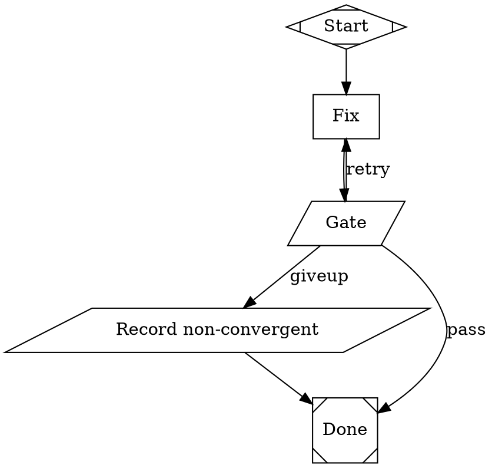

<!--
BUDGET — target 700 words, hard cap 1200 words. Excludes code, YAML and data tables.
Stories carry full context deliberately — cut restatement, never context an implementer needs.
Obey ${CLAUDE_PLUGIN_ROOT}/templates/writing-standard.md. Cut restatement, narration
and hedging first; never cut findings, citations, grounding labels, open questions, or
IDs a later phase reads. Over the cap? Say so in the document, and why.
-->

---
id: attractor-handoff-01
title: Build and prove the ADR-011 fix→gate fixture
status: ready
epic: attractor-handoff
supersedes: []
superseded_by: []
superseded_reason:
phase: Phase 1
requirements: [NFR-1, NFR-2]
depends_on: []
size: S
---

# Build and prove the ADR-011 fix→gate fixture

> This file is the complete context. Someone opening only this file — a teammate
> who missed the planning, or an agent with no memory of it — must be able to
> finish the work. Extract what is needed from the PRD and architecture into
> this document rather than linking out.

## Goal

Prove — by actually running it, not by trusting the design on paper — that
`ADR-011`'s bounded fix→acceptance-gate retry mechanism works exactly as decided:
a two-node loop that counts its own attempts in shell, routes three ways on
plain string equality, and halts with an honest `non-convergent` Outcome when
its declared bound is exhausted. This is roadmap Phase 1's "Spike 5" and the
first item on the initiative's critical path — every later phase (the sizing
formula in `OQ-2`/Spike 1, and the `L`-sized Phase 2 compiler that generates
this exact structure at scale) is stated in `roadmap.md` to depend on this
structure being confirmed first, not assumed.

## Context

`attractor-handoff/prd.md` `FR-8`/`FR-9` (scenario `S-3`) require every
acceptance gate to have a declared, artifact-visible attempt bound that halts
exactly there — never an unattended infinite loop, never a silent pass, and
exhausting the bound must produce `Outcome = non-convergent`, distinct from
`blocked`/`not attempted`/`done`. `ADR-011` records the mechanism chosen to
satisfy this, after two other mechanisms were tried and rejected empirically,
not by inference — one of them (`max_retries=`) was only fully documented
after this initiative filed a real gap against attractor's own README and got
it merged (`github.com/colombod/ai-augmentation-systems#40` → `#42`).
`architecture.md`'s Spike 5 and `roadmap.md`'s Phase 1 both treat this as
unproven until it is actually run: "the mechanism is now grammar-legal and
grounded in a real executed example, but has not itself been run yet."

This story closes that gap. The fixture, its lint result, and all three
scenario outputs quoted below were **directly executed in this environment
while writing this story** (`attractor doctor` confirmed passing first), not
predicted. Reproducing the same commands should yield the same shapes of
output; divergence is itself a finding worth recording, not proof the story
is wrong.

**Word budget:** this story runs to roughly 1,900 prose words against the
template's 1,200-word hard cap. Declared, not silent: the task briefing for
this story explicitly requires reproducing the exact DOT syntax, all three
rejected alternatives with their reasoning, the exact `--stub` commands, and
what confirms each of three acceptance scenarios — all inside this one file,
so a reader with no memory of the planning can refuse a "helpfully" reintroduced
`condition=` counter without re-deriving why it was already tried. Trimming
further would mean cutting one of those, which the template's own budget note
protects ("never cut findings... or IDs a later phase reads").

**Entry criteria (already confirmed, evidence below):** `attractor` plugin
installed; `attractor doctor` passes.

```
$ node plugins/attractor/dist/attractor.js doctor
attractor doctor
  ok       claude: 2.1.222 (Claude Code)
  ok       git: git version 2.50.1 (Apple Git-155)
  ok       sh: ok
  absent   bun (optional): not found
  ok       dot (optional): present
```

All commands below assume the working directory is the repo root
(`ai-augmentation-systems`, the directory containing `plugins/`).

## Files and modules

| Path | What to do |
| :-- | :-- |
| `plugins/delivery/.delivery/initiatives/attractor-handoff/spikes/adr-011-fix-gate-bounded.dot` | create — the fixture, exact content below |
| `plugins/delivery/.delivery/initiatives/attractor-handoff/spikes/adr-011-fixture-results.md` | create — real, invoked command output for all checks below (paths, exact commands, full stdout) so the sign-off is **Traceable**, not **Narrated** (glossary terms) |
| `plugins/attractor/dist/attractor.js` | use, unmodified — the CLI (`lint`, `run --stub`, `doctor`) |
| `plugins/attractor/skills/attractorify/examples/00-convergence-loop.dot` | reference only, unmodified — the unbounded shape this fixture extends |
| `plugins/attractor/README.md` | reference only, unmodified — the **Documented interface** (glossary term) this fixture must conform to |
| `plugins/delivery/.delivery/decisions/ADR-011-bounded-retry-mechanism.md` | reference only, unmodified — the decision this story proves |

Nothing in `plugins/attractor` is modified by this story — it is an external,
stable dependency (`architecture.md`'s Codebase context table).

## Interfaces and contracts to honor

`ADR-011`'s decision, in the abstract: the acceptance gate's own
`tool_command` runs the compiled check, increments a per-criterion counter
file it owns, and emits exactly one of three last-stdout-lines — `gate_pass`,
`gate_retry`, or `gate_giveup` (bound reached without passing). Three edges
route on plain string equality against `context.tool.last_line`, the one
operator `condition=` actually supports. Two node-visits per attempt (`fix` +
acceptance-gate), no separate bound-check or per-attempt record node.

This story's concrete instantiation — write this file verbatim as
`plugins/delivery/.delivery/initiatives/attractor-handoff/spikes/adr-011-fix-gate-bounded.dot`.
Verified: lints clean (`no errors`, exit 0), and all three scenarios in
Acceptance criteria below produced exactly the quoted output.



Node-ID convention `s3_c2__fix` / `s3_c2__gate` matches `architecture.md`'s
interfaces section (`<story-id>__<criterion-id>__{fix,gate}`) so this fixture
reads as a real, if synthetic, story/criterion pair — not an unrelated demo.
`${pass_at}` and `${bound}` are plain (non-dotted) `--param`-seeded context
values, substituted exactly like `${goal}` in `00-convergence-loop.dot` —
this is what lets one fixture file drive all three scenarios below by
varying `--param` per run, instead of hand-writing three separate `.dot`
files.

**Verified, important gotcha:** the run's own top-level `status:` line reads
`success` in **all three** scenarios below, including the give-up one —
attractor's engine-level status does not distinguish "acceptance gate passed"
from "acceptance gate exhausted its bound." The only reliable signals are the
printed `path:` line (which nodes were actually visited, in order) and the
`non_convergent` node's own marker file. Do not treat `status: success` as
proof the acceptance gate passed.

## Relevant design decisions

- **`ADR-011`** — the decision this story proves. Reproduced here because an
  implementer must be able to refuse a "helpful" rewrite toward a simpler-
  looking alternative without re-deriving why it was already tried and
  rejected:
  - **`condition=` counter comparison** (`context.attempt_count<3` on a
    `diamond` node) — looked like the most direct translation of "count
    attempts, compare to a bound." Rejected: `condition=`'s grammar
    (`core/condition.ts`) supports only `key=value`/`key!=value`/bare
    truthiness — no `<`/`>`/`<=`/`>=`. Re-confirmed directly in this session:
    `attractor lint` refuses `condition="context.attempt_count<3"` with
    `ERROR COND-001` (exit 1) — see Test approach's negative case.
  - **`max_retries=`/`retry_target=`** — real, documented, tested attributes
    purpose-built for bounding retries (once `#42` landed them in the
    README). Rejected: `max_retries` only matters for a `RETRY`-status
    verdict, and only a `box` (LLM) node with `goal_gate=true` making a
    self-assessed judgment can ever produce one — "an ordinary
    `box`/`parallelogram` node's outcome is always `SUCCESS` or `FAIL`,
    never `RETRY`" (`plugins/attractor/README.md`, verbatim). This fixture's
    acceptance gate is deliberately a `parallelogram`, precisely so nothing
    self-grades its own check; using `max_retries=` here would mean giving
    up that deterministic-check guarantee.
  - **Static unrolling** (N discrete fix/acceptance-gate pairs, one per
    allowed attempt) — syntactically legal, no shell arithmetic needed.
    Rejected: multiplies node count by the bound, worsening `NFR-1`'s
    500-node-visit ceiling exposure for no benefit once the shell-arithmetic
    approach was confirmed to work.
  What was chosen instead, and why it's trustworthy, is in Interfaces and
  contracts to honor above: all arithmetic lives in the shell one-liner
  inside `tool_command=`, checkable by `attractor lint` plus real `--stub`
  runs — exactly what this story does, rather than trusted secondhand.

## Acceptance criteria

Every criterion below was verified directly while writing this story; an
implementer reproducing the same commands should get the same shapes of
output.

- [ ] `NFR-1` (mechanism) — `attractor lint` on the fixture exits 0 with
      output `<path>/adr-011-fix-gate-bounded.dot: no errors` — no warnings
      either.
- [ ] `NFR-1` (mechanism, no first-touch off-by-one in the counter file) —
      **Scenario A: pass-first-attempt.** Run in a fresh, empty `--cwd` with
      no pre-existing counter file, `--param pass_at=1 --param bound=3`. The
      printed `path:` line must read exactly
      `start -> s3_c2__fix -> s3_c2__gate -> done`, and `events.jsonl` in
      `--run-dir` must contain exactly 4 `"type":"node.start"` events. (This
      is the case that would catch a counter starting at 0-already-passed or
      double-counting its first write — the reason the roadmap lists it as a
      separate scenario from fail-then-pass.)
- [ ] `ADR-011` / `FR-8` (bounded retry actually loops back and re-checks) —
      **Scenario B: fail-then-pass.** Same fixture, `--param pass_at=2
      --param bound=3`, fresh `--cwd`. The printed `path:` line must read
      exactly `start -> s3_c2__fix -> s3_c2__gate -> s3_c2__fix ->
      s3_c2__gate -> done` (two full fix/acceptance-gate cycles), and
      `events.jsonl` must contain exactly 6 `"type":"node.start"` events.
- [ ] `FR-8` (declared bound halts exactly there, not before or past) —
      **Scenario C: fail-through-bound.** Same fixture, `--param
      pass_at=99 --param bound=3`, fresh `--cwd`. The printed `path:` line
      must read exactly `start -> s3_c2__fix -> s3_c2__gate -> s3_c2__fix ->
      s3_c2__gate -> s3_c2__fix -> s3_c2__gate -> non_convergent -> done`
      — exactly three fix/acceptance-gate cycles, never a fourth — and
      `events.jsonl` must contain exactly 9 `"type":"node.start"` events,
      of which exactly 3 name `s3_c2__gate`.
- [ ] `FR-9` (Outcome = non-convergent is produced, distinct, never silent)
      — Scenario C's `--cwd`, at `.attractor-demo/outcomes.log`, must
      contain the literal line `FR-9 s3_c2 Outcome=non-convergent`. Do not
      substitute the run's top-level `status:` line as evidence — it reads
      `success` in Scenario C too (verified gotcha, above).
- [ ] `ADR-011` sign-off (the rejected `condition=` alternative stays
      rejected, re-verified in this environment, not just trusted from the
      ADR text) — a minimal fixture with an edge condition of
      `condition="context.attempt_count<3"` leaving a `goal_gate=true` node
      is refused by `attractor lint` with `ERROR COND-001` and non-zero exit.
- [ ] All of the above — commands, exact paths, and full stdout — is written
      into `adr-011-fixture-results.md` as real captured output. A result
      restated as prose without the command that produced it does not
      satisfy this story (glossary: **Invoked** / **Traceable**, not
      **Narrated**).

## Test approach

**Level:** integration — real `attractor lint` / `attractor run --stub`
against the real CLI, no synthetic substitute. `architecture.md`'s Test
strategy table assigns exactly this level to "Gate/fix loop convergence,
exhaustion, `outputs=` propagation," citing it as the same bug class
`research.md` found live in Argo Workflows: a retry's real outcome silently
failing to propagate into the overall verdict. A unit-level or mocked check
cannot catch that class of bug; only running the real engine can.

**Cases:**

| Case | Expected |
| :-- | :-- |
| happy path — pass-first-attempt (`pass_at=1 bound=3`, fresh `--cwd`) | `path:` ends after 1 fix/acceptance-gate cycle; 4 `node.start` events |
| retry recovers — fail-then-pass (`pass_at=2 bound=3`) | `path:` shows exactly 2 cycles then `-> done`; 6 `node.start` events |
| boundary/max — fail-through-bound (`pass_at=99 bound=3`) | `path:` shows exactly 3 cycles, never a 4th, then `-> non_convergent -> done`; 9 `node.start` events; `outcomes.log` written |
| invalid input | the rejected `condition="context.attempt_count<3"` mechanism is refused by lint, `ERROR COND-001`, exit 1 |
| empty / zero | N/A for this fixture — the bound is fixed at 3 by construction; validating a `bound=0` compiled value is Phase 2 compiler scope, not this hand-built fixture |
| permission denied / concurrent | N/A — one operator, sequential runs, disposable `mktemp -d` cwds; no shared `--run-dir` claim is made here (`NFR-4` is Phase 2 scope) |

**Run with** (from repo root; each scenario uses a fresh temp `--cwd` so the
counter file starts empty — this is load-bearing for Scenario A, see its
acceptance criterion above):

```
FIXTURE=plugins/delivery/.delivery/initiatives/attractor-handoff/spikes/adr-011-fix-gate-bounded.dot

# lint
node plugins/attractor/dist/attractor.js lint "$FIXTURE"

# Scenario A: pass-first-attempt
CWD_A=$(mktemp -d)
node plugins/attractor/dist/attractor.js run "$FIXTURE" \
  --cwd "$CWD_A" --stub --run-dir "$CWD_A/run" \
  --param pass_at=1 --param bound=3

# Scenario B: fail-then-pass
CWD_B=$(mktemp -d)
node plugins/attractor/dist/attractor.js run "$FIXTURE" \
  --cwd "$CWD_B" --stub --run-dir "$CWD_B/run" \
  --param pass_at=2 --param bound=3

# Scenario C: fail-through-bound
CWD_C=$(mktemp -d)
node plugins/attractor/dist/attractor.js run "$FIXTURE" \
  --cwd "$CWD_C" --stub --run-dir "$CWD_C/run" \
  --param pass_at=99 --param bound=3
cat "$CWD_C/.attractor-demo/outcomes.log"
grep -c '"type":"node.start"' "$CWD_C/run/events.jsonl"
```

Verified output actually produced by these exact commands, for reference
(your run should match in shape — node-visit counts and path text —
timestamps and temp-dir names will differ):

```
$ node plugins/attractor/dist/attractor.js lint "$FIXTURE"
<path>/adr-011-fix-gate-bounded.dot: no errors

# Scenario A
status: success
path:   start -> s3_c2__fix -> s3_c2__gate -> done
(events.jsonl: 4 node.start events)

# Scenario B
status: success
path:   start -> s3_c2__fix -> s3_c2__gate -> s3_c2__fix -> s3_c2__gate -> done
(events.jsonl: 6 node.start events)

# Scenario C
status: success
path:   start -> s3_c2__fix -> s3_c2__gate -> s3_c2__fix -> s3_c2__gate -> s3_c2__fix -> s3_c2__gate -> non_convergent -> done
(events.jsonl: 9 node.start events, 3 of them s3_c2__gate)
outcomes.log: "FR-9 s3_c2 Outcome=non-convergent"
```

Negative case (rejected `condition=` mechanism):

```
digraph rejected {
    start [shape=Mdiamond]
    gate [shape=parallelogram, goal_gate=true, tool_command="printf ok"]
    done [shape=Msquare]
    start -> gate
    gate -> done [condition="context.attempt_count<3"]
}
```

```
$ node plugins/attractor/dist/attractor.js lint rejected-condition-counter.dot
ERROR COND-001 <path>:gate: edge gate -> done has a malformed
condition="context.attempt_count<3"; each &&-joined clause must be either
"key=value", "key!=value", or a bare identifier ... -- anything else (a
hyphen, a space, stray punctuation) is a typo that would otherwise resolve
to an empty, always-false comparison instead of failing loudly
```

## Out of scope

- **Spike 1** (`OQ-2`'s real attempt-bound number) — `roadmap.md` states it
  "trustworthy only once Spike 5 confirms the structure," i.e. this story;
  sizing the actual number is a separate, dependent work item, not built
  here.
- **Spike 2** (`OQ-3`'s real timeout duration, and the fourth,
  deliberately-hanging fixture confirming attractor's `timeout=` attribute
  fires and counts as one consumed attempt) — a separate Phase 1 work item
  per `roadmap.md`'s table ("can run alongside Spike 5," not part of it).
  This fixture deliberately does not declare `timeout=` on the acceptance
  gate.
- **Spikes 3 and 4** (`OQ-9` doctor/worktree dry run; `OQ-10` drift
  precheck judgment) — unrelated questions, separate roadmap rows.
- **The Phase 2 compiler** that generates this exact two-node structure at
  scale from real sprint scope packages (`architecture.md`'s `L`-sized
  "Acceptance-gate compilation" item) — this story hand-builds and proves
  one fixture; it does not build the generator.
- **`validate-attractor-pipeline.js` and `compute-sprint-verdict.js`**
  (`NFR-1` sizing script, `FR-18` debt-taint walk) — separate Phase 1 work
  items in `roadmap.md`'s table.
- **`templates/sprint.md` / `skills/sprint/SKILL.md` enum edits** (the
  fourth `Outcome` value) — separate Phase 1 work item.

## Dependencies

None. This is an entry-criteria-only story: `attractor` plugin installed and
`attractor doctor` passing, both confirmed above. It is first on the
critical path — nothing in this initiative depends on it being done in
sequence with another story, but `roadmap.md` states Spike 1 depends on
*this story's* result being confirmed before its own sizing arithmetic can
be trusted.

## Implementation notes

Filled in during and after implementation. Record surprises, deviations from
the plan and the reason, and follow-up work — anything a future reader would
want. (Not yet started as of this story's authoring — the verification runs
quoted above were performed to ground the story's acceptance criteria in
real output, not as a claim that implementation is complete; the fixture and
results file still need to be created at the paths listed in Files and
modules.)
